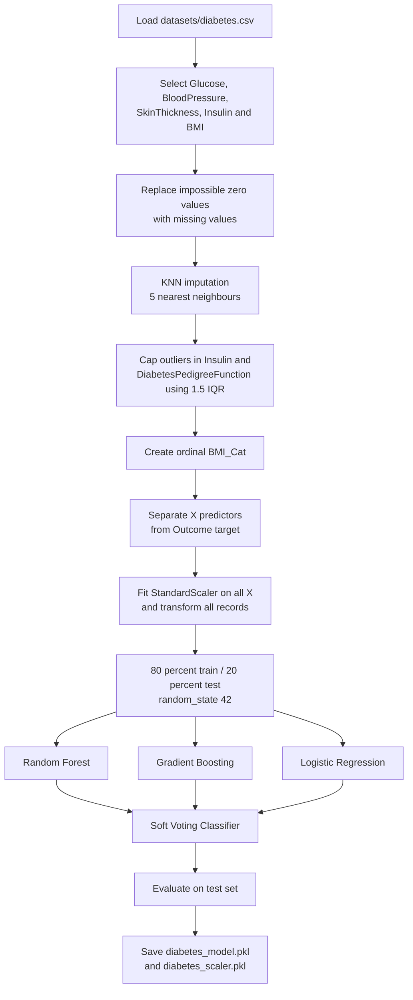
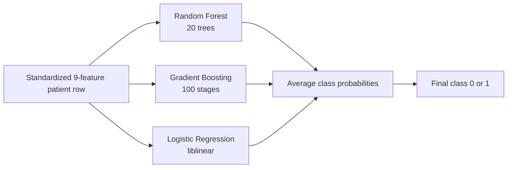
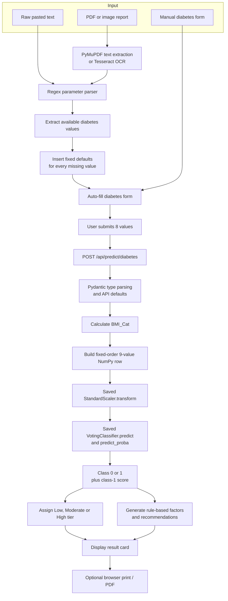
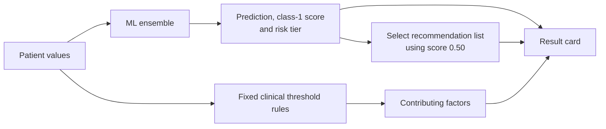
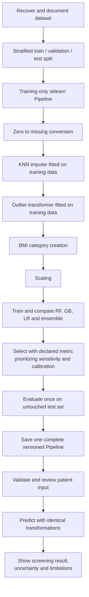

# Diabetes Mellitus Detection: Project Analysis and Pipeline

## 1. What the project targets

The diabetes module is a **binary classification system**. It predicts the dataset label `Outcome` from a patient's metabolic and demographic measurements.

- `Outcome = 1`: the application treats this as diabetes present / higher diabetes likelihood.
- `Outcome = 0`: the application treats this as diabetes absent / lower diabetes likelihood.

This is patient-level tabular classification. It does not detect an anatomical location, determine a diabetes type, measure disease severity, or replace diagnostic tests such as HbA1c or an oral glucose tolerance test.

## 2. Inputs used by the model

The original dataset contributes eight predictors. The project creates one additional predictor, `BMI_Cat`, so the deployed model receives nine values.

| Order | Model feature | Application field | Meaning |
|---:|---|---|---|
| 1 | `Pregnancies` | `pregnancies` | Number of pregnancies |
| 2 | `Glucose` | `glucose` | Plasma/fasting glucose value |
| 3 | `BloodPressure` | `blood_pressure` | Diastolic blood pressure |
| 4 | `SkinThickness` | `skin_thickness` | Triceps skinfold thickness |
| 5 | `Insulin` | `insulin` | Serum insulin |
| 6 | `BMI` | `bmi` | Body mass index |
| 7 | `DiabetesPedigreeFunction` | `dpf` | Dataset's family-history-related score |
| 8 | `Age` | `age` | Age in years |
| 9 | `BMI_Cat` | calculated by backend | Ordinal BMI group from 0 to 3 |

`BMI_Cat` is generated as follows:

```text
BMI < 18.5         -> 0 (underweight)
18.5 <= BMI < 25   -> 1 (normal)
25 <= BMI < 30     -> 2 (overweight)
BMI >= 30          -> 3 (obese)
```

The repository does not contain `datasets/diabetes.csv`. Therefore, the dataset source, record-level data, class counts, and label definition cannot be independently checked from the current repository.

## 3. Training pipeline in the notebook

The training notebook is `notebooks/Final_Diabetes_Prediction.ipynb`.



### Training preprocessing

1. Zero values in `Glucose`, `BloodPressure`, `SkinThickness`, `Insulin`, and `BMI` are treated as missing.
2. Missing values are filled with a `KNNImputer` using five neighbours.
3. Extreme values in `Insulin` and `DiabetesPedigreeFunction` are capped at the 1.5-IQR limits.
4. `BMI_Cat` is added.
5. All nine predictors are standardized with `StandardScaler`.
6. Data is split into 80% training and 20% testing using `random_state=42`.

No stratification is specified in the split. No oversampling, undersampling, SMOTE, or class weighting is implemented.

### Data-leakage issue

KNN imputation, outlier limits, and scaling are fitted **before** the train/test split. This allows information from the future test set to influence preprocessing and can make the reported test result optimistic. These operations should be fitted only on the training set inside one scikit-learn `Pipeline`.

## 4. Models actually trained



| Component | Configuration found in notebook | Function in ensemble |
|---|---|---|
| Random Forest | 20 trees, maximum depth 20, minimum split size 5, seed 42 | Learns non-linear rules and interactions through multiple trees |
| Gradient Boosting | 100 estimators, learning rate 0.1, maximum depth 3, seed 42 | Builds sequential trees that correct earlier errors |
| Logistic Regression | `liblinear` solver, seed 42 | Supplies a simpler linear probability model |
| Voting Classifier | Soft voting, equal default weights | Averages the three models' class probabilities |

The notebook calls the voting ensemble the best/final model, but it does not show a comparison table, hyperparameter search, cross-validation output, or selection criterion. Therefore, evidence that it performs better than each individual model is **not available in the repository**.

## 5. Live application pipeline

The user can enter values manually or transfer values extracted from a medical report.



### OCR-assisted input

- Digital PDFs are read with PyMuPDF.
- Scanned PDF pages are rendered at 200 DPI and passed to Tesseract.
- Images are converted to grayscale and contrast-enhanced before Tesseract OCR.
- Regular expressions extract glucose, blood pressure, insulin, BMI, age, skin thickness, pregnancies, and DPF where present.
- If DPF is missing but HbA1c is found, the code creates an estimated DPF using a custom formula. This conversion is a project heuristic, not part of the trained model's documented dataset definition.

When OCR cannot find a value, the backend silently inserts defaults:

| Missing field | OCR fallback |
|---|---:|
| Pregnancies | 1 for an identified female, otherwise 0 |
| Glucose | 110 |
| Blood pressure | 75 |
| Skin thickness | 23 |
| Insulin | 85 |
| BMI | 26.5 |
| DPF | 0.47 |
| Age | 35 |

These fallbacks are sent to the model like observed patient measurements. This can change the prediction and should be made visible and editable before analysis.

### Backend inference logic

The backend performs the following steps:

1. Loads `models/diabetes_model.pkl` and `models/diabetes_scaler.pkl` on first use.
2. Converts the eight submitted values to floating-point numbers.
3. derives `BMI_Cat`.
4. creates the nine-feature row in training order.
5. applies the saved scaler.
6. calls `predict()` for the binary class.
7. reads `predict_proba()[1]` as the class-1 score.
8. treats class `1` as diabetes present.

The score is converted to tiers:

```text
score >= 0.65             -> High Risk
0.35 <= score < 0.65      -> Moderate Risk
score < 0.35              -> Low Risk
```

The repository does not document how these tier thresholds were selected or clinically validated. The percentage should be described as the ensemble's **class-1 model score**, not a confirmed probability that the patient has or will develop diabetes.

## 6. Model output versus rule-based output

The result combines two different systems:



The displayed contributing factors are **not explanations generated by the ML model**. They are separate hard-coded checks:

- Glucose: moderate at 100–125; high from 126.
- BMI: moderate from 25; high from 30.
- Insulin: flagged above 166.
- Diastolic blood pressure: flagged from 85.

If none of these rules fires, the UI reports a stable/optimal metabolic profile even if another model feature drove a positive prediction. Conversely, the rules can display concerning factors while the model predicts a low score.

## 7. Evaluation recorded in the notebook

The notebook reports:

| Metric | Recorded value |
|---|---:|
| Training accuracy | 93.97% |
| Test accuracy | 76.62% |
| Class 0 precision / recall / F1 | 0.81 / 0.83 / 0.82 |
| Class 1 precision / recall / F1 | 0.68 / 0.65 / 0.67 |
| Test records | 154 |

Recorded confusion matrix:

```text
                 Predicted 0   Predicted 1
Actual 0              82             17
Actual 1              19             36
```

Assuming class `1` is diabetes-positive:

- 36 positive records were detected.
- 19 positive records were missed (false negatives).
- 17 negative records were flagged positive (false positives).
- Positive-class sensitivity/recall is about 65%.
- Specificity is about 83% (`82 / 99`).

ROC-AUC, probability calibration, repeated cross-validation, external validation, and subgroup evaluation are not available in the notebook. The gap between training accuracy (93.97%) and test accuracy (76.62%) also suggests overfitting.

## 8. Important implementation gaps

### Training and live preprocessing do not match

The live backend calculates `BMI_Cat` and scales the row, but it does not run the training-time KNN imputer or outlier caps. Manual zero values and extreme insulin/DPF values therefore reach the scaler/model differently from comparable training data.

### Preprocessing objects are incomplete

Only the model and scaler are saved. The fitted KNN imputer and learned outlier limits are not saved. Exact training transformations cannot be reproduced for live data.

### Current serialized model is not loadable in the checked environment

The artifacts were saved with scikit-learn 1.8.0, while the repository's current virtual environment uses 1.9.0. Loading the diabetes ensemble currently ends with:

```text
ModuleNotFoundError: No module named '_loss'
```

Therefore the documented inference code exists, but live diabetes prediction was **not operational in the checked environment**. The model should be rebuilt under the pinned runtime version or served with the exact compatible dependency version.

### Input validation is weak

The browser form contains ranges, but the FastAPI schema mostly checks types and supplies defaults. A direct API client can bypass the browser ranges. Missing values are silently replaced rather than explicitly reviewed.

## 9. Recommended corrected pipeline



Priority actions:

1. Restore and document the dataset and target semantics.
2. Split before fitting any preprocessing and use stratification.
3. package every transformation and the classifier in one saved pipeline.
4. pin the exact scikit-learn version and add a startup inference test.
5. remove silent OCR defaults or clearly label them as imputed and require user confirmation.
6. compare individual models against the ensemble and document the selection metric.
7. report sensitivity, specificity, precision, F1, ROC-AUC, calibration, and subgroup behavior.
8. replace diagnostic wording with qualified screening language and state that clinical testing is required.

## 10. Final interpretation

The project targets diabetes by combining eight patient measurements plus an engineered BMI category in a three-model soft-voting ensemble. Its application flow—from manual/OCR input through scaling, prediction, tiering, and a result card—is clearly implemented in code. However, missing dataset artifacts, preprocessing leakage, inconsistent training-versus-serving transformations, silent default values, limited evaluation, and the current model-loading failure prevent the output from being treated as a dependable medical finding.
