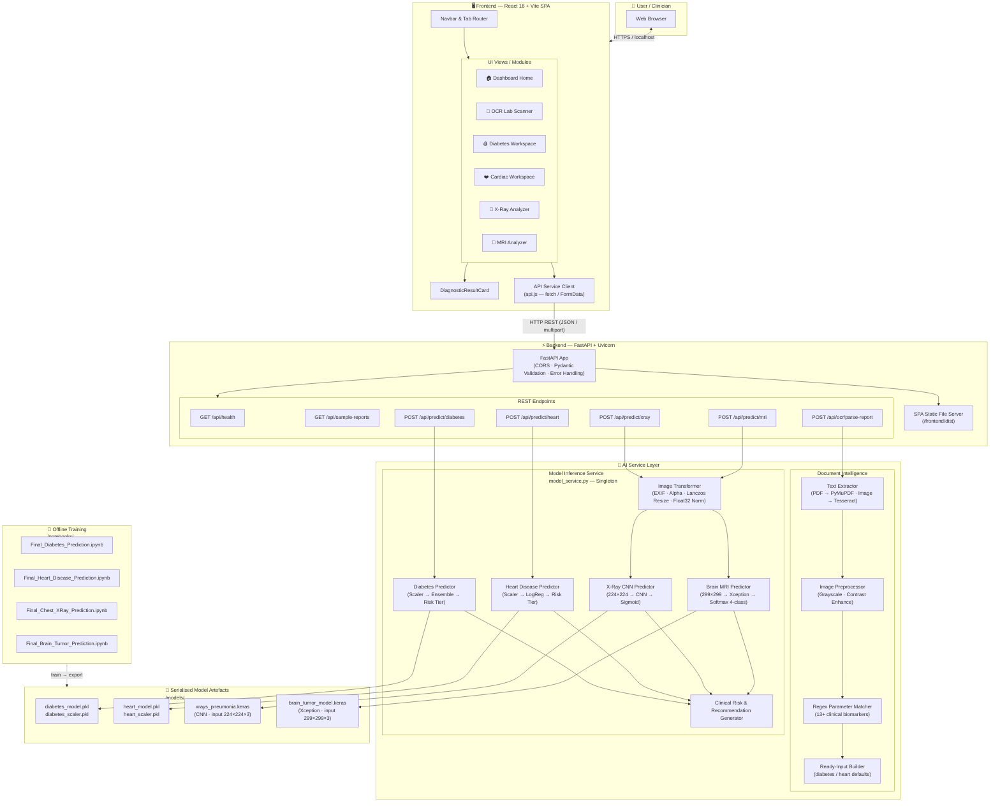
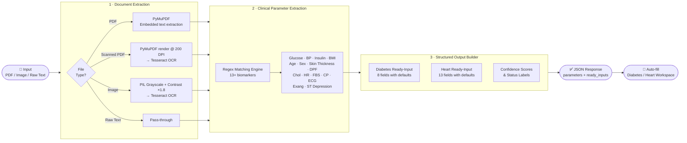
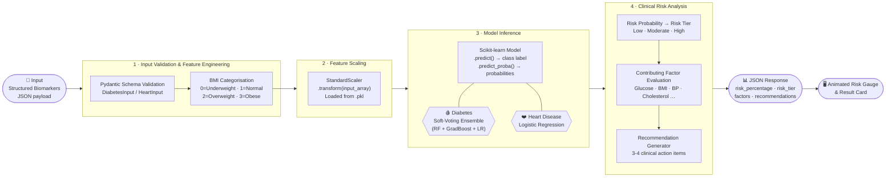

<div align="center">
  <h1>MedSynapse: AI Multi-Disease Prediction & Medical Report OCR 🏥</h1>
  <h3>🏆 Next-Gen AI Healthcare & Medical Diagnostics Project</h3>

  <p><i>"Revolutionizing Early Diagnostics with Automated Medical Report OCR & Multi-Modal Clinical AI"</i></p>

  <div>
    
    
    
    
    
  </div>
</div>

---

## 🚀 Overview

**MedSynapse** is an AI-powered clinical screening and diagnostic platform designed to assist healthcare professionals and individuals in early disease detection and lab report analysis.

The system combines **Computer Vision**, **Machine Learning ensembles**, and **Document Intelligence (OCR)** into a unified clinical dashboard:
1. **Automated Lab Report OCR**: Drop any medical lab report (PDF or Image) to automatically extract Glucose, Blood Pressure, Insulin, BMI, Cholesterol, Heart Rate, and ECG indicators with confidence scoring.
2. **Multi-Disease Prediction Models**: Soft-voting ensembles and classification models for **Diabetes Mellitus** and **Coronary Heart Disease**.
3. **Medical Imaging Analysis**: Deep Convolutional Neural Networks for **Chest X-Ray (Pneumonia)** and **Cranial MRI (Brain Tumor 4-class differential)**.
4. **Clinical Risk Scoring & Reporting**: Animated circular risk gauges, biomarker impact breakdowns, and one-click printable / PDF medical summaries.

---

## 🏗️ System Architecture



> **Architecture at a Glance**
> | Layer | Technology | Responsibility |
> | :--- | :--- | :--- |
> | **Client / SPA** | React 18, Vite, Lucide | Interactive dashboard, file uploads, animated risk gauges, result cards |
> | **API Gateway** | FastAPI, Uvicorn, Pydantic | Routing, request validation, CORS, SPA serving |
> | **Document Intelligence** | PyMuPDF, Tesseract OCR, PIL | PDF/image text extraction, contrast enhancement, regex biomarker parsing |
> | **ML Inference** | Scikit-learn, NumPy | Diabetes (soft-voting ensemble) & Heart disease (Logistic Regression + Scaler) prediction |
> | **DL Vision Inference** | TensorFlow / Keras 3 | Pneumonia detection (CNN) & Brain tumor 4-class classification (Xception) |
> | **Model Storage** | `.pkl`, `.keras` files | Pre-trained weights & scalers; lazy-loaded singleton pattern |
> | **Offline Training** | Jupyter Notebooks | Dataset exploration, model training, and artefact export |

---

## 📑 Diagnostic Modules & AI Stack

| Module | Diagnostic Domain | Model Architecture | Key Biomarkers / Scans |
| :--- | :--- | :--- | :--- |
| 🩸 **Diabetes Mellitus** | Metabolic & Glycemic Risk | **Soft-Voting Ensemble** (RF + GradBoost + LR) | Glucose, Insulin, BMI, Blood Pressure, Age |
| ❤️ **Coronary Heart Disease** | Cardiovascular Disease | **Logistic Regression + Scaler** | Resting BP, Cholesterol, Max HR, Angina, ST Dep |
| 🩻 **Pneumonia Detection** | Pulmonary Imaging | **Deep CNN Vision Model** | Chest Radiograph (X-Ray) • Auto-transformed to (224, 224, 3) |
| 🧠 **Brain Tumor Classification** | Neuro-Oncology | **Xception Transfer Learning** | Cranial MRI Scan • Auto-transformed to (299, 299, 3) |
| 📄 **Smart Report OCR** | Document Intelligence | **Tesseract OCR + PyMuPDF** | PDF / Image Clinical Lab Reports |

---

## 🖼️ Automated Medical Image Transformation Pipeline

To ensure deep learning vision models execute seamlessly without shape mismatch errors, the application includes a dedicated preprocessing engine:
- **Arbitrary Size Handling**: Automatically accepts any input resolution or aspect ratio (e.g., `1920×1080`, `3000×2000`, `800×400`, `512×512`).
- **High-Fidelity Resampling**: Uses Lanczos interpolation (`Image.Resampling.LANCZOS`) to preserve fine anatomical boundaries and infiltrates.
- **EXIF Auto-Orientation**: Transposes camera/scanner orientation tags so images are evaluated in the correct medical orientation.
- **Color Channel & Alpha Blending**: Safely handles RGBA, Grayscale, CMYK, and indexed palettes by compositing over neutral black medical backgrounds.
- **Strict Tensor Standardization**: Output tensors are validated to exact dimensions:
  - **X-Ray Pneumonia CNN**: `(1, 224, 224, 3)` normalized to `float32 [0.0, 1.0]`
  - **Brain Tumor Xception**: `(1, 299, 299, 3)` normalized to `float32 [0.0, 1.0]`

---

## 🔄 Project Pipeline

The system has **three independent but interoperable pipelines** that share a common API gateway and result card component.

---

### Pipeline 1 — Smart Lab Report OCR

Converts any raw clinical document (PDF or image) into structured biomarker values ready to feed directly into Prediction Pipeline 2.



---

### Pipeline 2 — Tabular ML Prediction  *(Diabetes & Heart Disease)*

Processes structured clinical biomarkers through scikit-learn models to produce a risk tier, probability score, contributing factors, and clinical recommendations.



---

### Pipeline 3 — Medical Imaging AI  *(X-Ray & Brain MRI)*

Accepts arbitrary-resolution medical scan images and runs them through a standardised preprocessing pipeline before deep learning inference.

```mermaid
flowchart LR
    A(["🖼️ Input\nChest X-Ray or Brain MRI\nany size / format"]) --> B

    subgraph B["1 · Image Preprocessing\ntransform_image()"]
        B1["EXIF Transpose\nOrientation correction"]
        B2["Alpha / Transparency Handling\nComposite over black background"]
        B3["Color Mode Normalisation\nAny mode → RGB"]
        B4["High-Fidelity Resampling\nLanczos interpolation"]
        B5["Float32 Normalisation\nPixel values → 0.0 – 1.0"]
        B6["Batch Dimension Expand\nshape (1, H, W, 3)"]
        B1 --> B2 --> B3 --> B4 --> B5 --> B6
    end

    B6 --> C

    subgraph C["2 · Target Tensor Shape"]
        C1{{"🩻 X-Ray\n(1, 224, 224, 3)"}}
        C2{{"🧠 Brain MRI\n(1, 299, 299, 3)"}}
    end

    C --> D

    subgraph D["3 · Deep Learning Inference"]
        D1{{"🩻 Chest X-Ray CNN\nSigmoid → Pneumonia Probability"}}
        D2{{"🧠 Xception Transfer Learning\nSoftmax → 4-Class Probabilities"}}
        C1 --> D1
        C2 --> D2
    end

    D --> E

    subgraph E["4 · Result Interpretation"]
        E1["X-Ray: Pneumonia / Normal\nConfidence %"]
        E2["MRI: Glioma · Meningioma\nPituitary · No Tumor\nPer-class probability breakdown"]
        D1 --> E1
        D2 --> E2
    end

    E --> F(["📋 JSON Response\ndiagnosis · confidence\nclass_probabilities\nrecommendations"])
    F --> G(["🖥️ Visual Diagnosis Card\n& Probability Bars"])
```



---

## 📂 Project Structure

```
├── backend/              # FastAPI Application & Backend Core
│   ├── main.py           # API routes for OCR, Predictions & SPA serving
│   └── services/         # AI & Document Intelligence Core Services
│       ├── model_service.py # Unified ML/DL model inference & image transformation
│       └── ocr_service.py   # Tesseract OCR & clinical parameter extraction
├── frontend/             # Modern React + Vite Web Application
│   ├── src/
│   │   ├── components/   # Dashboard, OCR Studio, Disease Workspaces & Results
│   │   ├── services/     # Frontend API Client
│   │   ├── App.jsx       # Main Application & Navigation
│   │   └── index.css     # Clinical Glassmorphism Design System
│   └── package.json
├── models/               # Trained ML & Deep Learning Models (.pkl, .keras)
├── test_reports/         # Dummy Clinical Reports & Scans (PDF, PNG, TXT)
│   ├── sample_diabetic_report.pdf  # Comprehensive Diabetic Panel
│   ├── sample_cardiac_report.pdf   # Cardiovascular Stress Report
│   ├── sample_healthy_report.png   # Routine Wellness Screening Image
│   └── sample_prediabetic_report.txt # Raw Text Lab Report
├── notebooks/            # Jupyter training & research notebooks
├── scripts/              # Verification & utility scripts
│   └── verify_models.py  # Automated model verification script
├── run_app.py            # Unified application launcher (configurable port)
├── run_app.sh            # One-click startup shell script
├── requirements.txt      # Python dependencies
└── README.md             # Project Documentation
```

---

## 📡 REST API Reference

| Endpoint | Method | Payload / Form Data | Description |
| :--- | :--- | :--- | :--- |
| `/api/health` | `GET` | — | System health status & model availability check |
| `/api/sample-reports` | `GET` | — | Preset clinical reports for instant OCR demo |
| `/api/ocr/parse-report` | `POST` | `file` (PDF/Image) or `raw_text` | Extracts 13+ clinical parameters via OCR |
| `/api/predict/diabetes` | `POST` | JSON: `DiabetesInput` | Evaluates glycemic risk & contributing factors |
| `/api/predict/heart` | `POST` | JSON: `HeartInput` | Evaluates coronary heart disease risk |
| `/api/predict/xray` | `POST` | `file` (Radiograph image) | Deep CNN inference for acute pneumonia |
| `/api/predict/mri` | `POST` | `file` (Cranial MRI image) | Xception 4-class intracranial tumor classification |

---

## 💻 Quick Start & Running Locally

### 1️⃣ Install Dependencies
```bash
pip install -r requirements.txt
cd frontend && npm install && npm run build && cd ..
```

### 2️⃣ Verify AI Models (Optional)
```bash
python scripts/verify_models.py
```

### 3️⃣ Launch Application
```bash
# Runs on default port 8080 (or auto-selects next free port)
python run_app.py

# Or specify a custom port:
python run_app.py --port 5050
```
*Or use the shell script:*
```bash
./run_app.sh
```

Navigate to **`http://localhost:5050`** (or your selected port) in your browser.

---

## 🧪 Testing with Sample Data

The `test_reports/` directory contains sample clinical reports and scans for testing:
- **`sample_diabetic_report.pdf`**: Upload to **OCR Lab Report Scanner** to auto-extract parameters and run Diabetes prediction.
- **`sample_cardiac_report.pdf`**: Upload to test coronary heart disease parameter extraction.
- **`sample_healthy_report.png`**: Test OCR extraction on image-based lab reports.
- **Interactive 1-Click Demos**: Every disease workspace includes 1-click test scan and sample preset buttons for immediate evaluation without uploading files.

---

## 👥 Contributors

**Team - MEDSYNAPSE**

| Name | Role | Profile |
| :--- | :--- | :--- |
| **Shivam Maurya** | AI & Robotics Engineer | [](https://github.com/ShivamMaurya14) |

