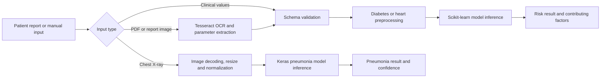

# MedSynapse Disease Analyzer

MedSynapse is a local AI-assisted screening application with three active prediction modules:

- Diabetes mellitus risk prediction from structured clinical measurements
- Coronary heart disease risk prediction from 13 clinical inputs
- Pneumonia screening from chest X-ray images

The application also includes OCR for extracting clinical values from PDF and image reports. Predictions are screening outputs and are not medical diagnoses.

## Current pipeline


```mermaid
flowchart LR
    A[Patient report or manual input] --> B{Input type}
    B -->|PDF or report image| C[Tesseract OCR and parameter extraction]
    B -->|Clinical values| D[Schema validation]
    B -->|Chest X-ray| E[Image decoding, resize and normalization]
    C --> D
    D --> F[Diabetes or heart preprocessing]
    F --> G[Scikit-learn model inference]
    E --> H[Keras pneumonia model inference]
    G --> I[Risk result and contributing factors]
    H --> J[Pneumonia result and confidence]
```

## Technology

| Layer | Implementation |
|---|---|
| Frontend | React, Vite, Lucide React |
| API | FastAPI, Pydantic |
| OCR | Tesseract OCR, PyMuPDF |
| Tabular ML | scikit-learn, NumPy |
| Image ML | TensorFlow / Keras, Pillow |
| Local feature store | SQLite |

## Active endpoints

| Endpoint | Purpose |
|---|---|
| `GET /api/health` | Reports API and active model-artifact status |
| `GET /api/sample-reports` | Returns sample clinical text reports |
| `POST /api/ocr/parse-report` | Extracts clinical parameters from text, PDF, or image input |
| `POST /api/predict/diabetes` | Runs diabetes risk prediction |
| `POST /api/predict/diabetes/from-feature-store/{id}` | Runs diabetes prediction from stored validated features |
| `POST /api/predict/heart` | Runs coronary heart disease risk prediction |
| `POST /api/predict/xray` | Runs pneumonia screening on a chest X-ray |

## Run locally

```bash
python run_app.py
```

The launcher serves the API and built frontend, normally at `http://localhost:8080`.

For frontend development:

```bash
cd frontend
npm install
npm run dev
```

## Important limitation

The models depend on the training data and preprocessing used by the notebooks and saved artifacts. Their output should support—not replace—evaluation by a qualified clinician.
