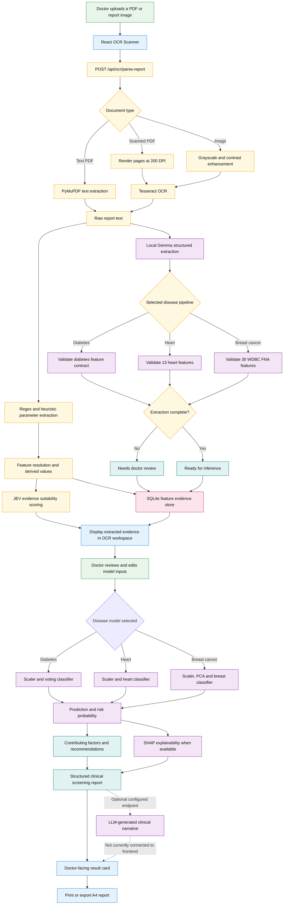

# MedSynapse Report Upload Architecture



## Current primary runtime path

```text
Doctor upload -> OCR -> parameter extraction -> doctor review/edit
-> disease model -> risk result -> printable screening report
```

> The LLM narrative and persisted clinician approval are backend foundations that are not yet connected to the current frontend workflow.
